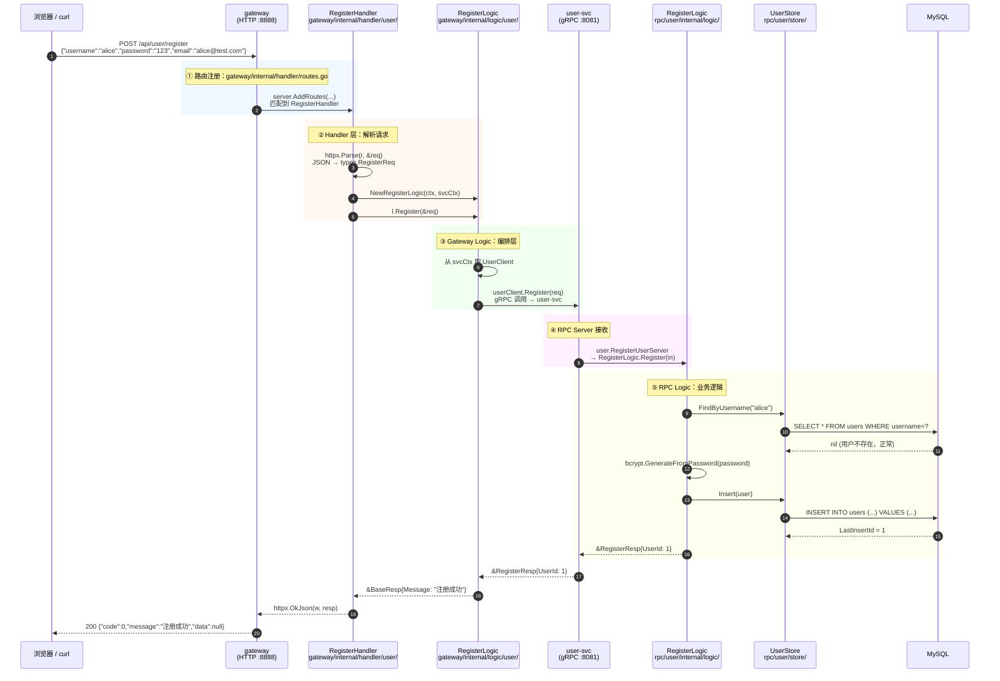
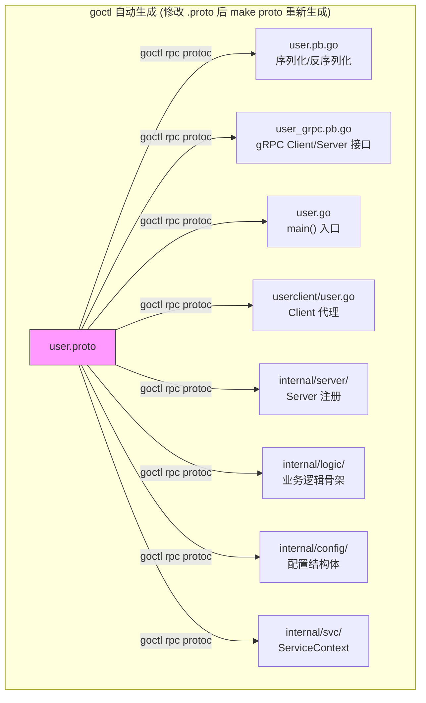
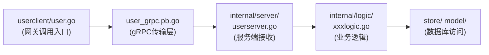
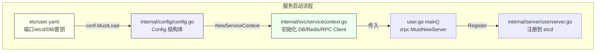
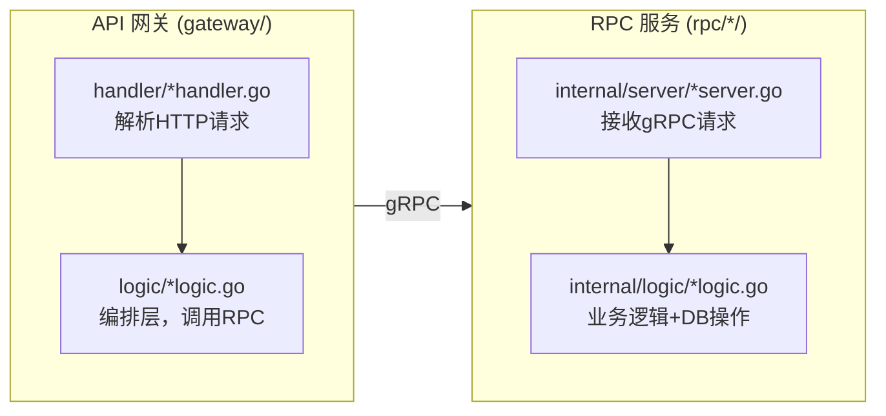
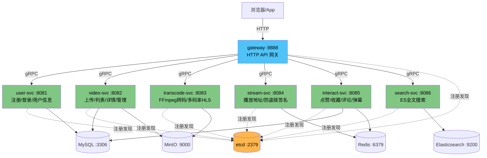
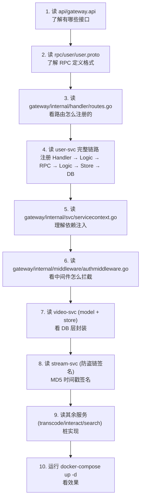

# GoPan 源码阅读指南

> 以「用户注册 → 登录」为例，按 go-zero 框架的标准分层，逐层阅读 7 个微服务的代码。

---

## 一、阅读路径总览

```mermaid
flowchart LR
    subgraph step1[" ① 定义层 "]
        PROTO["rpc/**/*.proto"]
        API["api/gateway.api"]
    end

    subgraph step2[" ② 生成代码层 "]
        PB["*.pb.go / *_grpc.pb.go"]
        ZRPC["zrpc 桩: user.go / userclient/"]
        ZAPI["rest 桩: handler/ logic/ types/"]
    end

    subgraph step3[" ③ 配置 & 启动 "]
        YAML["etc/*.yaml"]
        CONFIG["internal/config/"]
        SVC["internal/svc/"]
    end

    subgraph step4[" ④ 基础设施 "]
        MODEL["model/"]
        STORE["store/"]
        MIDDLEWARE["middleware/"]
    end

    subgraph step5[" ⑤ 业务逻辑 "]
        RPC_LOGIC["rpc/*/internal/logic/"]
        GW_LOGIC["gateway/internal/logic/"]
    end

    step1 --> step2 --> step3 --> step4 --> step5
```



---

## 二、一条完整的注册请求是怎么流转的？

以 `POST /api/user/register` 为例，从 HTTP 请求到 MySQL INSERT 全链路。



---

## 三、按层次分步阅读

### 第 1 步：看定义（不用懂代码，看接口长什么样）

| 文件 | 说明 | 重点看什么 |
|------|------|-----------|
| `api/gateway.api` | 所有 HTTP 接口定义 | `@handler` 和 `post/get/put/delete` 路由 |
| `rpc/user/user.proto` | 用户服务 RPC 定义 | `service User` 下的 `rpc` 方法签名 |
| `rpc/video/video.proto` | 视频服务 RPC 定义 | 流的声明 `stream` / 普通 `rpc` |
| `rpc/stream/stream.proto` | 播放服务 RPC 定义 | `GetPlayUrl` 防盗链 |
| `rpc/interact/interact.proto` | 互动服务 RPC 定义 | 点赞/评论/弹幕 |
| `rpc/transcode/transcode.proto` | 转码服务 RPC 定义 | 任务提交与查询 |
| `rpc/search/search.proto` | 搜索服务 RPC 定义 | ES 索引/搜索 |

### 第 2 步：看自动生成代码（理解 go-zero 的分层模式）

**以 user-svc 为例**，代码生成后的文件分工：



访问顺序（从外到内）：



### 第 3 步：看配置 & 启动过程



关键文件（每个服务都一样模式）：

| 文件 | 作用 |
|------|------|
| `rpc/user/user.go` | 入口 `main()`，加载配置，启动 gRPC server |
| `rpc/user/internal/config/config.go` | 定义配置结构体（yaml → struct） |
| `rpc/user/internal/svc/servicecontext.go` | 服务上下文，持有 DB 连接、RPC Client 等 |
| `rpc/user/internal/server/userserver.go` | gRPC Server，将请求路由到 logic |

### 第 4 步：看业务逻辑（最核心）

**每条链路都是三段式**：



重点阅读文件（以用户注册为例）：

```
gateway/internal/handler/user/registerhandler.go    ← 解析 HTTP 请求
gateway/internal/logic/user/registerlogic.go        ← 调用 user-svc RPC
rpc/user/internal/logic/registerlogic.go            ← 校验用户名 + bcrypt + INSERT
rpc/user/store/user.go                              ← 数据库操作
rpc/user/model/user.go                              ← 数据模型
```

### 第 5 步：看中间件 & 公共层

| 文件 | 说明 |
|------|------|
| `gateway/internal/middleware/authmiddleware.go` | JWT 鉴权中间件，拦截 `/api/video/*` 路由 |
| `common/response/response.go` | 统一错误码和响应格式 |

---

## 四、7 个服务依赖关系



---

## 五、推荐阅读顺序



---

## 六、核心概念速查

| go-zero 概念 | 对应位置 | 说明 |
|-------------|---------|------|
| `.api` 文件 | `api/gateway.api` | HTTP 接口定义，goctl 生成 handler/logic/types |
| `.proto` 文件 | `rpc/*/*.proto` | gRPC 接口定义，goctl 生成 pb + zrpc 桩 |
| Handler | `gateway/internal/handler/` | 解析 HTTP 请求/响应，不做业务 |
| Logic | `gateway/internal/logic/` + `rpc/*/internal/logic/` | 业务逻辑，写代码的地方 |
| ServiceContext | `*/internal/svc/servicecontext.go` | 依赖注入容器（DB、Redis、RPC Client 等） |
| Config | `*/internal/config/config.go` | yaml → struct 映射 |
| Routes | `gateway/internal/handler/routes.go` | 路由注册，goctl 自动生成勿手动改 |
| Middleware | `gateway/internal/middleware/` | HTTP 中间件（鉴权） |
| Model | `rpc/*/model/` | 数据库表结构映射 |
| Store | `rpc/*/store/` | 数据库 CRUD 操作封装 |
