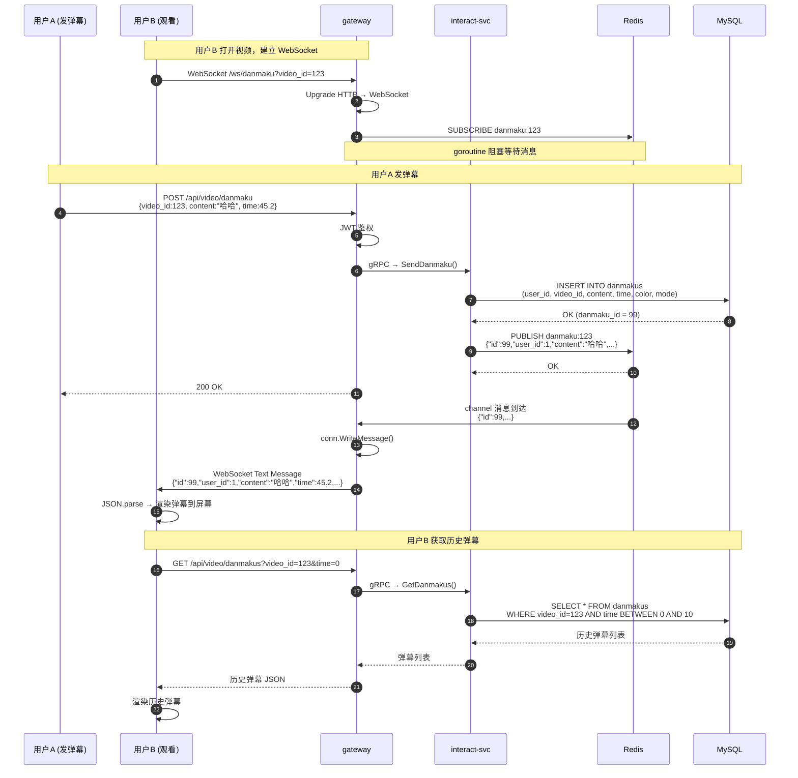

# 弹幕 WebSocket 全链路流程

## 发送端（用户 A 发弹幕）

```
1. 用户 A 浏览器
   │  POST /api/video/danmaku  { video_id: 123, content: "哈哈", time: 45.2 }
   ▼
2. gateway (HTTP :8888)
   │  JWT 鉴权 → 转发到 interact-svc
   ▼
3. interact-svc (:8085)
   │  INSERT INTO danmakus (user_id, video_id, content, time, color, mode)
   │  ✅ 持久化到 MySQL
   │
   │  Redis PUBLISH danmaku:123 '{"id":99,"user_id":1,"content":"哈哈","time":45.2}'
   │  ✅ 发布到 Redis Pub/Sub 频道
   ▼
4. Redis
   │  Channel: danmaku:123
   │  → 路由给所有订阅了这个频道的客户端
   ▼
5. gateway WebSocket Server
   │  每个 WebSocket 连接都 goroutine 订阅了 "danmaku:123"
   │  go-redis Subscribe() → channel ← 收到消息
   │  conn.WriteMessage(WebSocket.TextMessage, msg.Payload)
   │  ✅ 推送给所有连接的浏览器
   ▼
6. 用户 B/C/D 浏览器
   │  ws.onmessage(event) → JSON.parse(event.data)
   │  → 渲染弹幕到屏幕上
```

## 接收端（用户 B 打开视频）

```
1. 用户 B 浏览器
   │  new WebSocket("ws://localhost:8888/ws/danmaku?video_id=123")
   ▼
2. gateway WebSocket Server
   │  Upgrade HTTP → WebSocket
   │  video_id = "123"
   │
   │  rdb.Subscribe(ctx, "danmaku:123")
   │  goroutine 阻塞读取 channel
   ▼
3. 等待 Redis 频道消息...
   │  用户 A 发弹幕 → Redis 推送 → gateway 收到 → ws 转发
   │  用户 C 发弹幕 → 一样
```

## 历史弹幕（用户 B 初次打开）

```
用户 B 打开视频 → GET /api/video/danmakus?video_id=123&time=0
  → interact-svc → SELECT * FROM danmakus WHERE video_id=123 AND time BETWEEN 0 AND 10
  → 返回 0~10 秒时间范围内的所有历史弹幕
  → 前端渲染
```

**三层数据流**：MySQL 持久化 → Redis Pub/Sub 实时推送 → WebSocket 浏览器通道。

---

## 时序图



## 角色说明

| 角色 | 作用 |
|------|------|
| 用户A 浏览器 | 发送弹幕，REST API |
| 用户B 浏览器 | 接收弹幕，WebSocket + REST API（历史） |
| gateway | HTTP → 路由转发 + WebSocket 升级 + Redis 订阅转发 |
| interact-svc | 写 MySQL（持久化）+ Redis Publish（推送） |
| Redis | Pub/Sub 实时消息通道 |
| MySQL | 弹幕持久化存储 |

## 关键设计决策

| 决策 | 理由 |
|------|------|
| 持久化走 MySQL，推送走 Redis | MySQL 保证不丢数据，Redis 保证低延迟推送 |
| 历史弹幕走 REST API | WebSocket 只负责实时，历史数据用 REST 加载更简单 |
| gateway 兼做 WebSocket server | 复用同一端口 8888，不需要额外服务 |
| 每个 WebSocket 连接独立订阅 Redis | 视频切走时连接断开，自动取消订阅，无资源泄漏 |
