# GoPan 多机部署指南

## 为什么需要多机部署

GoPan 当前所有服务跑在一台机器上，适用于开发和低流量场景。当用户量增加时，需要把服务拆到多台机器：

| 问题 | 单机 | 多机 |
|------|------|------|
| 单点故障 | 挂了全站不可用 | 单台挂了不影响 |
| 资源竞争 | MySQL/Redis/ES/FFmpeg 共享 CPU | 各服务独立资源 |
| 弹性扩容 | 只能升级配置 | 按需加机器 |

---

## 部署架构

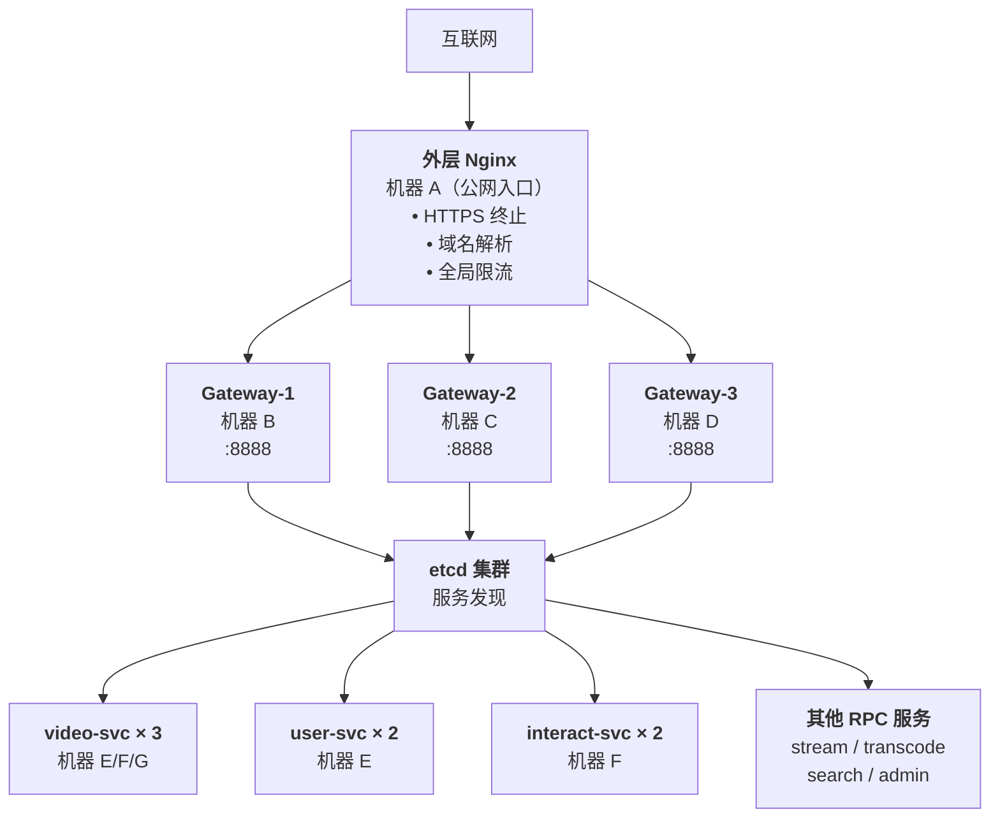

---

## 服务发现与负载均衡流程

### 启动阶段：RPC 服务注册到 etcd

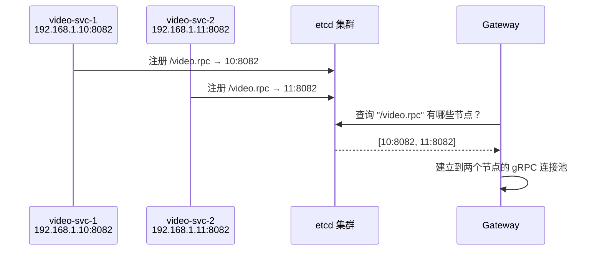

### 请求阶段：自动负载均衡

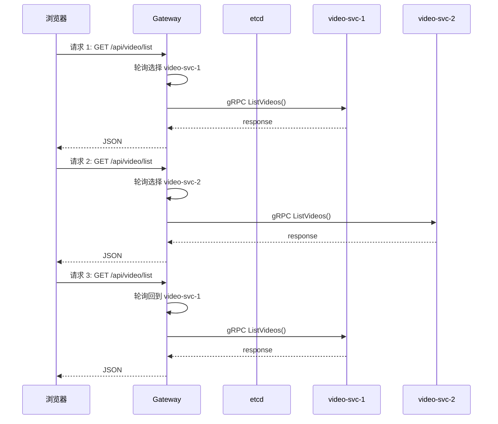

### 故障阶段：自动摘除

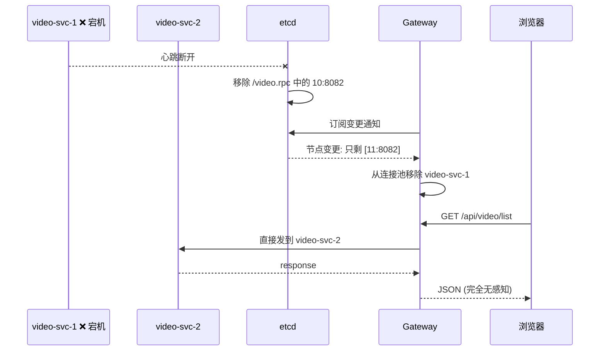

---

## 各层配置要点

### 1. etcd 集群

- **必须部署独立机器或多台**（至少 3 节点保证高可用）
- 所有服务的 etcd 地址指向同一集群
- 每个 RPC 服务使用相同的 `Key` 注册（如 `video.rpc`）

### 2. Gateway 层

| 配置项 | 说明 |
|--------|------|
| `etcd:2379` | 指向 etcd 集群地址 |
| `Key: video.rpc` | 通过 etcd 发现所有 video-svc 实例 |
| `MaxConns: 10000` | 每个 gateway 实例的最大并发连接数 |
| 负载均衡 | go-zero 内置，自动轮询所有 RPC 实例 |

**Gateway 本身不需要在 etcd 注册**——它是 HTTP 入口，由外层 Nginx 做负载均衡。

### 3. RPC 服务层

每个 RPC 服务可部署多份，只需在 yaml 中保持 `Etcd.Key` 一致：

```yaml
# 机器 E 上的 video-svc
Etcd:
  Hosts:
    - etcd:2379
  Key: video.rpc   # ← 关键：多实例必须用相同的 Key

# 机器 F 上的 video-svc
Etcd:
  Hosts:
    - etcd:2379
  Key: video.rpc   # ← 相同的 Key
```

### 4. 中间件

| 组件 | 部署方式 | 说明 |
|------|---------|------|
| MySQL | 独立机器/云数据库 | 所有服务连接同一数据库 |
| Redis | 独立机器/云 Redis | 缓存 + Pub/Sub + 限流 |
| MinIO | 独立机器/云对象存储 | 视频文件存储 |
| Kafka | 3 节点集群（最小） | 转码任务削峰 |
| Elasticsearch | 独立机器 | 视频搜索 |

---

## 水平扩展表

| 服务 | 扩展策略 | 触发条件 | 新实例需要改什么 |
|------|---------|---------|-----------------|
| Gateway | 增加机器 | CPU > 70% 或 QPS 接近 MaxConns | 不改代码，改外层 Nginx upstream |
| video-svc | 增加机器 | MySQL 连接池耗尽或延迟增大 | 不改代码，yaml 中 `Etcd.Key` 相同即可 |
| user-svc | 增加机器 | 同上 | 同上 |
| interact-svc | 增加机器 | 弹幕/评论写入延迟增大 | 同上 |
| transcode-svc | 增加机器 | Kafka 消费 lag 持续增长 | 不改代码，加入同一 Consumer Group |
| stream-svc | 增加机器 | 播放 URL 请求量过大 | 同上 |

---

## CDN 与 HLS 缓存：三层缓存架构

### 概念澄清

| 概念 | 是什么 | 部署在哪 |
|---|---|---|
| **CDN（Content Delivery Network）** | 全球分布的缓存节点网络，离用户最近的节点提供内容 | 各地区节点（北京、上海、东京等） |
| **源站 Nginx proxy_cache** | 源站本地磁盘缓存，减少后端 MinIO 的请求压力 | 你的 Gateway 机器上 |
| **回源** | CDN 节点没有缓存时，回到你的源站拉取文件 | — |

**项目中的 `nginx.conf` 配置的 proxy_cache 不是 CDN，而是源站侧的本地缓存层**——用于加速 CDN 回源请求。

### 三层缓存架构

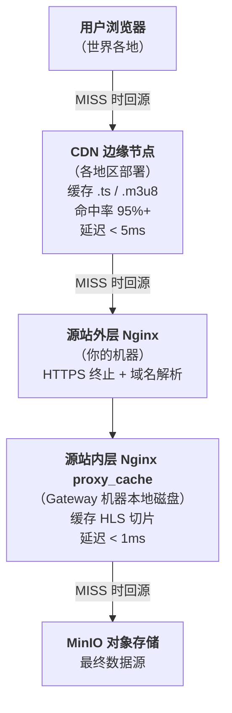

### 各层职责

| 层 | 缓存位置 | 命中后延迟 | 作用 |
|---|---|---|---|
| CDN 边缘节点 | 全球各数据中心 | < 5ms | 离用户最近，减少跨地域网络延迟 |
| 源站 proxy_cache | 源站本地磁盘 | < 1ms | 减少 MinIO 请求，CDN 回源时加速 |
| MinIO | 源站 Docker 容器 | ~10ms | 视频文件的最终存储 |

### 请求流程

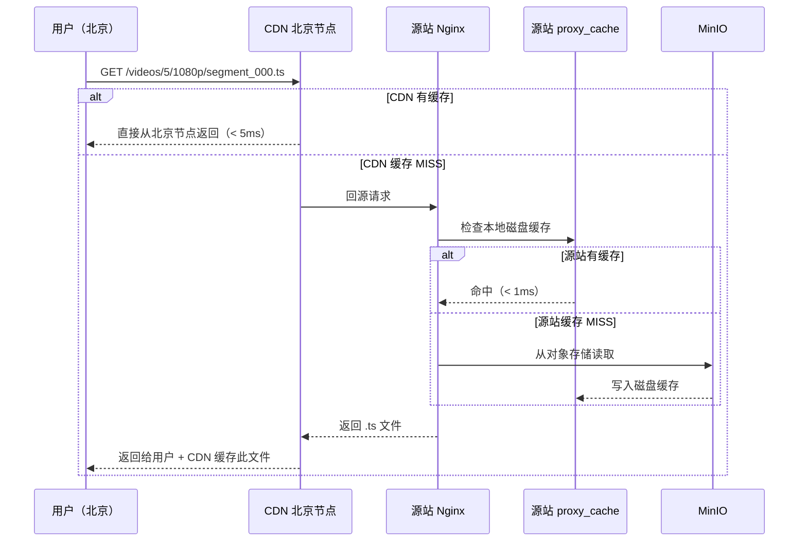

### 为什么需要三层缓存

1. **CDN 边缘节点**（第一层）：用户离源站可能很远（北京↔深圳），CDN 把内容拉到离用户最近的节点，延迟从 50ms 降到 5ms
2. **源站 proxy_cache**（第二层）：如果 CDN 有 10 个边缘节点都缓存 MISS，源站只需要从 MinIO 取一次，其余 9 次从本地磁盘返回——保护 MinIO 不被大量并发回源请求打崩
3. **MinIO**（第三层）：最终数据源，只在缓存全部 MISS 时才被访问

### 当前项目的实现

项目中的 `nginx/nginx.conf` 已配置 `proxy_cache` 作为源站本地缓存。CDN 边缘节点需要在外部 CDN 服务商（阿里云 CDN / Cloudflare）配置，将源站指向你的域名即可。

---

## 外层 Nginx vs 内层 Nginx

两者都部署在你自己的机器上（与 CDN 不同，CDN 是外部服务商部署在全球各地的机器）。区别在于**职责和位置**：

### 对比

| | 外层 Nginx | 内层 Nginx |
|---|---|---|
| **部署位置** | 公网入口机器（机器 A） | 每台 Gateway 机器上（机器 B/C/D） |
| **数量** | 1-2 台（主 + 备） | Gateway 有几台就有几台 |
| **面对谁** | 互联网用户 / CDN | 外层 Nginx |
| **职责** | HTTPS 终止、域名解析、全局限流、反向代理 | HLS 磁盘缓存、反向代理到 MinIO |
| **是否做缓存** | 否 | 是（proxy_cache 缓存 .ts/.m3u8） |
| **配置文件** | 需单独编写 | 项目现有的 `nginx/nginx.conf` |

### 架构图

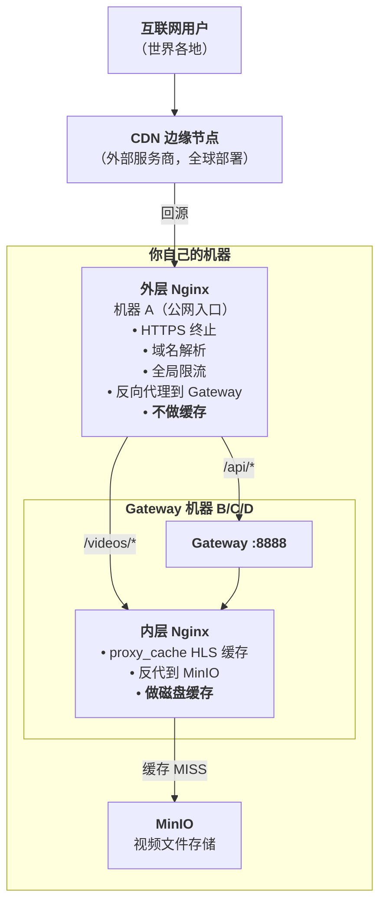

### 为什么需要外层 + 内层两层？

| 原因 | 说明 |
|---|---|
| **职责分离** | 外层只管"接客"（HTTPS、域名、限流），内层只管"缓存视频" |
| **水平扩展** | Gateway 从 1 台扩到 10 台，外层 Nginx 不用动，只需要加 upstream 里的 IP。内层 Nginx 随着 Gateway 走，每台 Gateway 机器自带 |
| **缓存本地化** | 内层 Nginx 在每台 Gateway 机器上，HLS 缓存存在本地磁盘。不需要网络共享，命中率极高 |
| **故障隔离** | 如果内层 Nginx 宕机，只影响一台 Gateway。外层 Nginx 宕机则全站不可用 |

### 单机部署时的简化

当前项目只有一台机器时，外层和内层可以合并为一个 Nginx（如当前 `docker-compose.yml` 中的 `nginx` 服务既做反向代理又做 HLS 缓存）。拆到多机后，外层单独一台，内层跟随每台 Gateway。

### 两层 Nginx 的请求路径

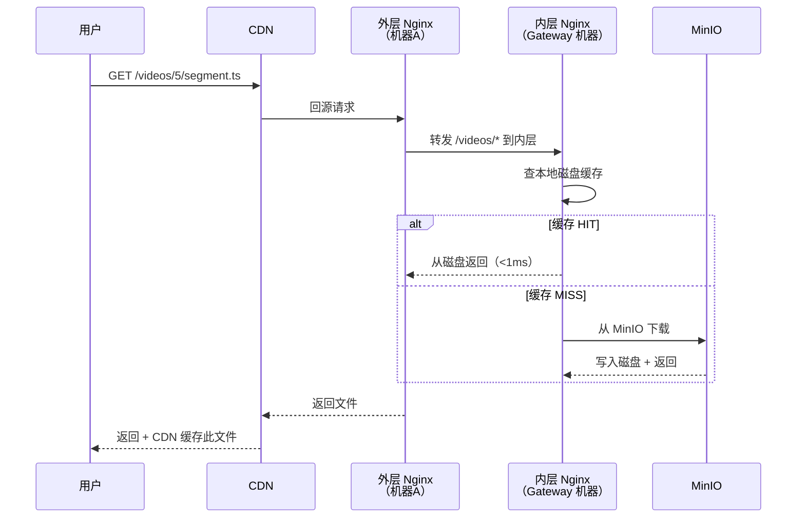

---

## Nginx 部署说明

### 外层 Nginx（公网入口，1 台）

```nginx
upstream gateway {
    server 192.168.1.20:8888 weight=1;  # Gateway-1
    server 192.168.1.21:8888 weight=1;  # Gateway-2
    server 192.168.1.22:8888 weight=1;  # Gateway-3
    keepalive 100;
}

server {
    listen 80;
    location /api/ {
        proxy_pass http://gateway;
    }
    location /ws/ {
        proxy_pass http://gateway;
        proxy_http_version 1.1;
        proxy_set_header Upgrade $http_upgrade;
        proxy_set_header Connection "upgrade";
    }
}
```

### 内层 Nginx（每台 Gateway 机器上，做 HLS 缓存）

当前已配置在 `nginx/nginx.conf` 中，部署到每台 Gateway 机器即可。

---

## 部署步骤

### 1. 准备机器

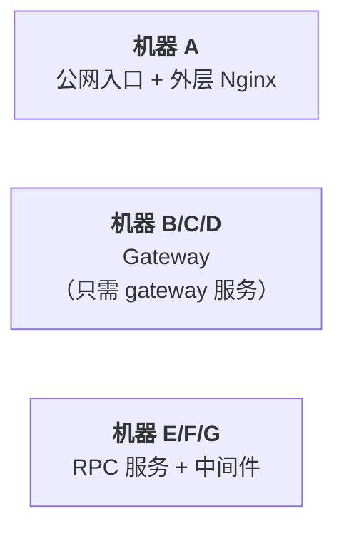

### 2. 配置 etcd

```bash
# 在所有机器上，将 etcd 地址指向同一个集群
etcd.endpoints = ["etcd-cluster-1:2379", "etcd-cluster-2:2379", "etcd-cluster-3:2379"]
```

### 3. 部署 RPC 服务

```bash
# 在每台 RPC 机器上
docker compose up -d user-svc video-svc interact-svc stream-svc transcode-svc search-svc admin-svc
```

### 4. 部署 Gateway

```bash
# 在每台 Gateway 机器上
docker compose up -d gateway nginx
```

### 5. 配置外层 Nginx（机器 A）

更新 upstream 指向所有 Gateway 机器 IP。

### 6. 验证

```bash
# 查看 etcd 注册情况
etcdctl get --prefix /video.rpc

# 压测验证负载均衡
wrk -c 100 -d 30s http://外层Nginx/api/video/list
```

---

## 注意事项

1. **etcd 必须先部署**：它是服务发现的基石，至少 3 节点保证高可用
2. **RPC Key 必须一致**：同一服务的所有实例在 yaml 中 `Etcd.Key` 必须完全相同
3. **Gateway 无状态**：可以任意扩缩容，不存储任何会话数据
4. **JWT 密钥一致**：所有 Gateway 实例必须配置相同的 `Auth.AccessSecret`
5. **Redis 共享**：令牌桶、弹幕 Pub/Sub、播放进度都依赖 Redis，各节点需连同一 Redis
6. **HLS 缓存本地化**：内层 Nginx 的 `proxy_cache` 缓存在各自机器的 `/tmp/nginx_cache`，不需要共享

---

## 最小多机部署（3 台机器）

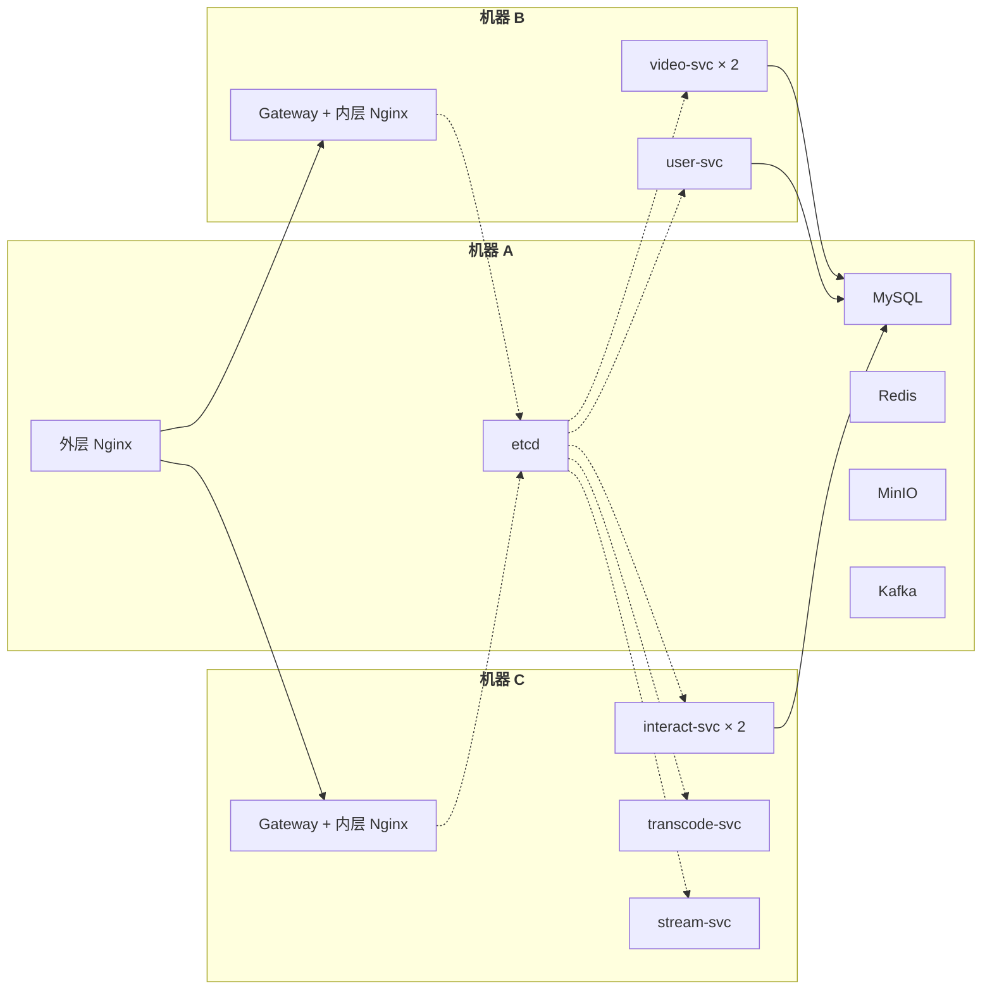

---

## 完整多机部署（生产级）

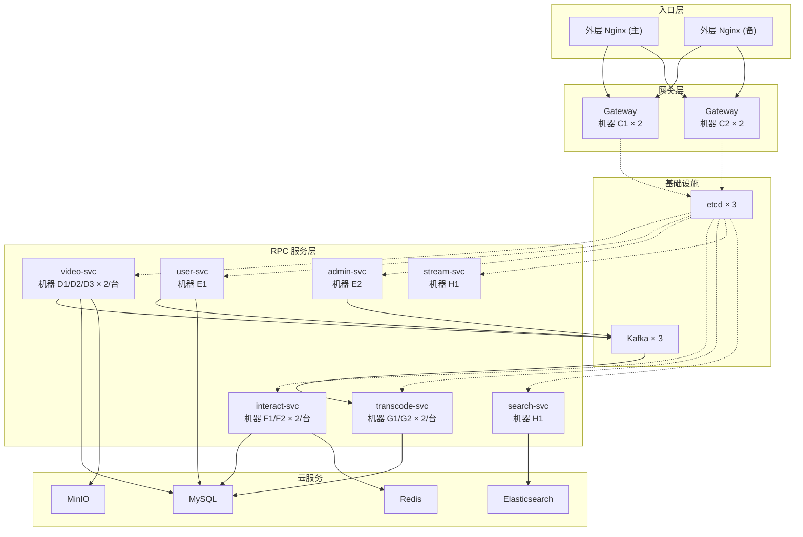

| 机器 | 部署内容 |
|------|---------|
| A1/A2 | 外层 Nginx（主备） |
| B1/B2/B3 | etcd 集群 + Kafka 集群 |
| C1/C2 | Gateway × 2/台 |
| D1/D2/D3 | video-svc × 2/台 |
| E1/E2 | user-svc + admin-svc |
| F1/F2 | interact-svc × 2/台 |
| G1/G2 | transcode-svc × 2/台 |
| H1 | stream-svc + search-svc |
| 云服务 | MySQL、Redis、MinIO、Elasticsearch |

---

# QA

### Q1: 客户端请求经过外层 Nginx 后，如何分发给内层 Nginx？如何决定分发给哪个内层 Nginx？

**1. 请求类型分工**：
- **API 业务请求 (`/api/*`)**：直接由外层 Nginx 负载均衡并转发给各机器上的 **go-zero Gateway**（主业务端口 `:8888`）。
- **视频资源静态请求 (`/videos/*`)**：外层 Nginx 会转发给各台 Gateway 机器上部署的 **内层 Nginx**。内层 Nginx 负责处理本地 `proxy_cache` 视频 HLS 切片的缓存与 MinIO 回源。

**2. 路由与负载均衡分派算法**：
- 对于 API 业务请求：外层 Nginx 配置文件中的 `upstream` 默认采用 **轮询（Round Robin）** 或 **最少连接数（least_conn）** 策略。
- 对于视频资源（`.ts` / `.m3u8`）请求：推荐采用 **一致性哈希（Consistent Hash）** 算法绑定请求路径：
  ```nginx
  upstream inner_nginx {
      hash $request_uri consistent; # 同一视频的所有切片，永远精准转发给同一台内层 Nginx
      server 192.168.1.20:80;      # Gateway-1 机器
      server 192.168.1.21:80;      # Gateway-2 机器
  }
  ```
  这样能确保同一视频切片资源在同一台内层 Nginx 上集中命中缓存，极大提升磁盘 `proxy_cache` 的缓存效率，避免缓存节点间的数据重复和分散。

---

### Q2: 同样的内层 Nginx 通过 etcd 发现其他服务，若转码服务部署在多台机器，内层 Nginx 如何分发转码请求任务？如何决定要分发给哪台机器上的转码服务？

**纠正误区**：**内层 Nginx 并不参与转码任务的分发，也完全不使用 etcd。**

视频转码服务的负载均衡和任务分派是采用 **基于消息队列（Kafka）的异步削峰 / 消费者组模式** 实现的：

**1. 任务分派媒介**：
- 当用户视频合并完毕后，`video-svc` 并不直接和转码服务同步通信，而是向 **Kafka** 投递一条转码任务消息（包含视频 ID 及 ObjectKey 等）。

**2. 如何决定交给哪台机器（Kafka 消费者组机制）**：
- 部署在各机器上的 `transcode-svc` 实例作为消费者，它们在配置文件中均配为 **相同的 Consumer Group**（例如 `gopan-transcode-group`）。
- Kafka 会根据订阅 Topic 的 Partition 数量和该 Group 下活跃的 `transcode-svc` 客户端实例数量，运行内置的分区分配算法。
- **自动指派与拉取**：Kafka 的不同分区消息会被自动指定推/拉（Pull）到某一个 `transcode-svc` 实例。
- **弹性扩缩容**：若是新增一台转码机器，Kafka 会触发 **Rebalance（重平衡）**，重新平衡分配分区任务；若某台转码服务器宕机，对应的承载任务会被 Kafka 自动移交给其余活着的转码实例，保障系统可用性。

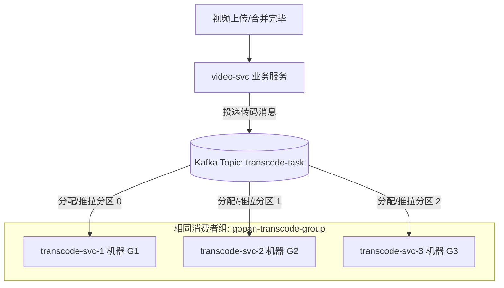

---

### Q3: 若 video-svc 微服务部署在多台服务器，一个视频的上传请求片段会被分发到不同的主机吗？多机分散上传如何确保核心数据的正确合并和一致性？

**1. 分片会分散到不同机器（YES）**：
- **第一层分流 (Nginx)**：前端并发调用 `/api/video/upload/chunk`，经过外层代理时，请求被轮询机制指派给不同的 Gateway 网关节点（如 `chunk_0` 发给 Gateway-1，`chunk_1` 发给 Gateway-2）。
- **第二层分流 (gRPC LB)**：网关内部的 gRPC 客户端基于 etcd 的健康节点列表和 P2C 算法进行二次负载分配，同一个 Gateway 可能会将分片分派到不同的 `video-svc` 自主后端节点（如 `video-svc-1` 或 `video-svc-2`）。

**2. 核心架构保障 ── 集中式共享存储（Stateless）**：
虽然分片请求极其分散地流向不同的服务器实例，但 `video-svc` 逻辑设计完全 **无状态**，所有状态都交付于中央存写：
- **数据存储（集中至 MinIO）**：
  各台接收到分片的 `video-svc` 并不写本地磁盘，而是直接调用 PutObject 上传到全局共享的 **MinIO 集群**，落盘 Key 规定为：`parts/{video_id}/chunk_{index}`。
- **进度记账（集中至 Redis）**：
  分片上传完毕，对应的 `video-svc` 在共享 Redis 服务中将该 `chunk_index` 记录到对应 `upload_id` 的 Set 数据集中。
- **任务合并（通过 Kafka）**：
  客户端触发 `/api/video/upload/merge` 请求。收到合并 RPC 的 `video-svc` 任意节点去全局 Redis 核实并确保分片数量配齐。核对无误后，组装 Merge 任务发往 **Kafka**，最终由异步合并节点从 **MinIO** 下载整批分片，顺序拼接还原成大视频文件，并回传最终完整视频。

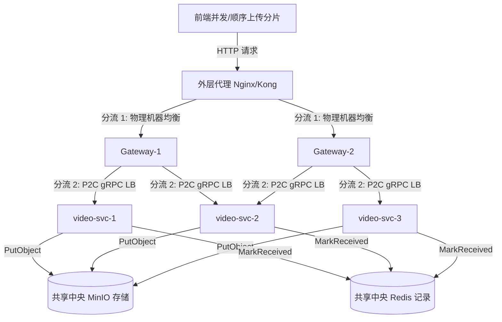

